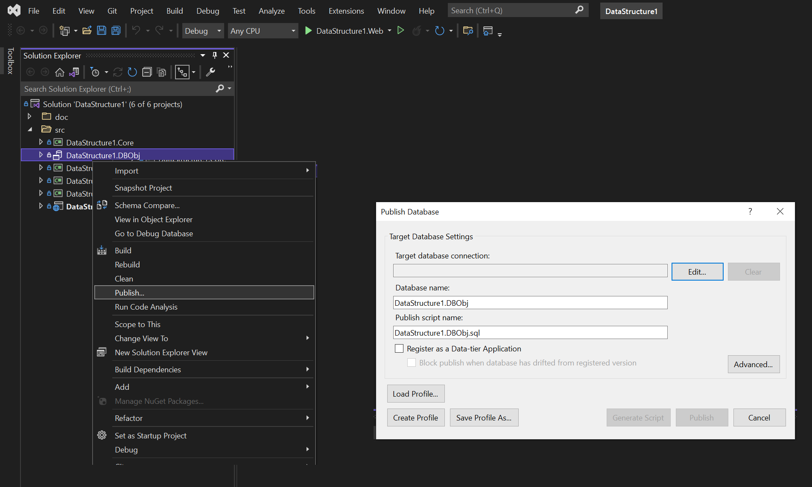

# MultiDataAccess-Structure
Domain-Driven Design (DDD) Template Structure to impelement independent data persistent layer. 
In this solution, the gole is to independentize core and business layer from persistent layer. 
The persistent layer can be any storage database system or in-memory or event a blockchain solution.
For example, SQL Server and MongoDB has been implemented in this solution.


## Table of Contents
* [How to Setup](#setup)
* [General Description](#desc)
* [Template Structure](#structure)
* [Technologies](#technology)
* [Whats Next](#next)
* [Licensing](#license)
* [Upcomming](#upcomming)
* [References](#references)


## How to Setup
After downloading the clone, follow these steps:
* For creating SQL Server database, right-click on `DataStructure1.DBObj` project and select `Publish`. Mongo collection will be created automatically.


* For setting SQL Server and MongoDB connections, on `DataStructure1.Web` project, go to `appsettings.json` file and change settings:

```json
"ConnectionStrings": {
    "DefaultCnn": "Data Source=(localdb)\\ProjectModels;Initial Catalog=dbDataStructure1;Integrated Security=True;Connect Timeout=60;Encrypt=False;TrustServerCertificate=False;ApplicationIntent=ReadWrite;MultiSubnetFailover=False",
    "MongoUri": "mongodb://127.0.0.1:27017",
    "MongoDatabase": "DataStructure"
  }
```

* Now if you want to choose between SQL Server or MongoDB, make it enable and the other disable by true/false in `appsettings.json` file:

```json
  "SqlServerEnabled": "true",
  "MongoDBEnabled": "flase"
```
