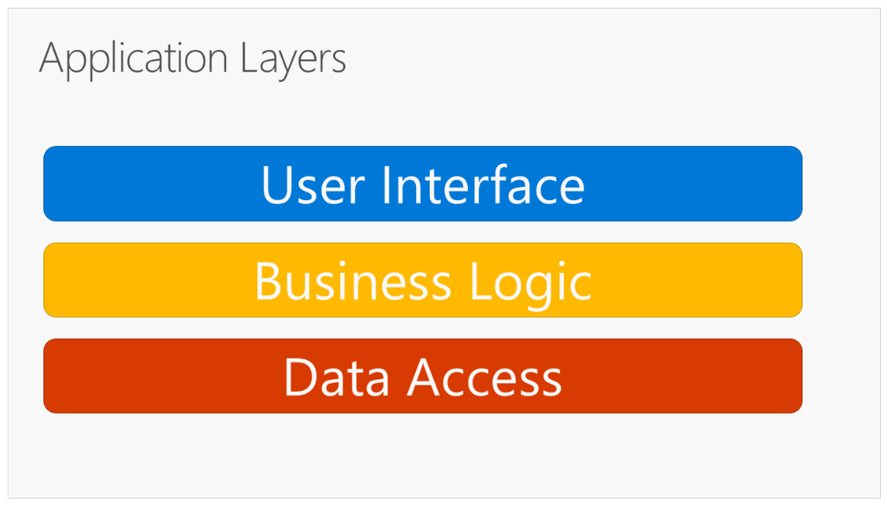
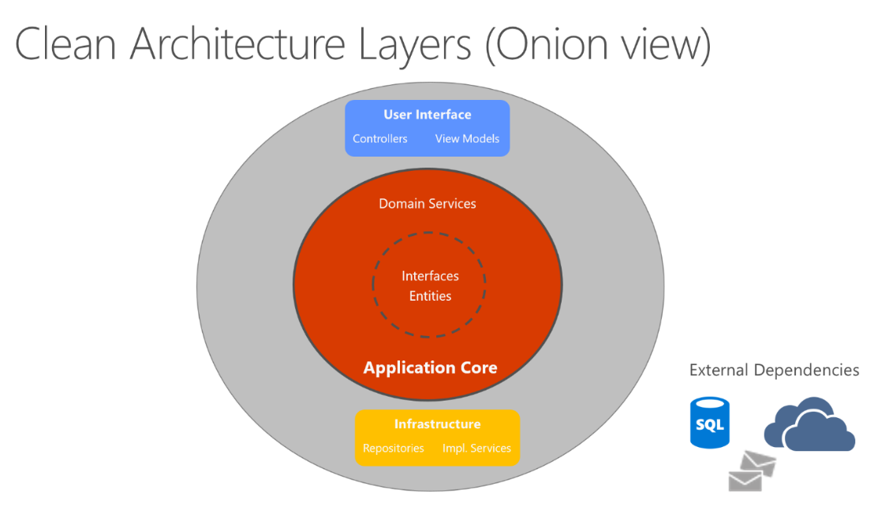

# MultiDataAccess-Structure
Domain-Driven Design (DDD) Template Structure to impelement independent data persistent layer. 
In this solution, the gole is to independentize core and business layer from persistent layer. 
The persistent layer can be any storage database system or in-memory or even a blockchain solution.
For example, SQL Server and MongoDB has been implemented in this solution.


## Table of Contents
* [How to Setup](#how-to-setup)
* [General Description](#general-description)
* [Template Structure](#template-structure)
* [Technologies](#technologies)
* [Whats Next](#whats-next)
* [Licensing](#licensing)
* [Upcomming](#upcomming)
* [References](#references)


## How to Setup
After downloading the clone, follow these steps:
* For creating SQL Server database, right-click on `DataStructure1.DBObj` project and select `Publish`. Mongo collection will be created automatically.


* For setting SQL Server and MongoDB connections, on `DataStructure1.Web` project, go to `appsettings.json` file and change settings:

```json
"ConnectionStrings": {
    "DefaultCnn": "Data Source=(localdb)\\ProjectModels;Initial Catalog=dbDataStructure1;Integrated Security=True;Connect Timeout=60;Encrypt=False;TrustServerCertificate=False;ApplicationIntent=ReadWrite;MultiSubnetFailover=False",
    "MongoUri": "mongodb://127.0.0.1:27017",
    "MongoDatabase": "DataStructure"
  }
```

* Now if you want to choose between SQL Server or MongoDB, make it enable and the other disable by true/false in `appsettings.json` file:

```json
  "SqlServerEnabled": "true",
  "MongoDBEnabled": "false"
```

* Make `DataStructure1.web` as start up project and run it and after that go to *Employees page*.

## General Description
All description of this section has been chosen from *[Architecting Modern Web Applications with ASP.NET Core and Microsoft Azure](https://docs.microsoft.com/en-us/dotnet/architecture/modern-web-apps-azure/)* book:


> Traditional N-Layer architecture applications:
> These layers are frequently abbreviated as UI, BLL (Business Logic Layer), and DAL (Data Access Layer).
> Using this architecture, users make requests through the UI layer, which interacts only with the BLL.
> The BLL, in turn, can call the DAL for data access requests. The UI layer shouldn’t make any requests to
> the DAL directly, nor should it interact with persistence directly through other means. Likewise, the BLL
> should only interact with persistence by going through the DAL. In this way, each layer has its own
> well-known responsibility.
>
> One disadvantage of this traditional layering approach is that compile-time dependencies run from
> the top to the bottom. That is, the UI layer depends on the BLL, which depends on the DAL. This
> means that the BLL, which usually holds the most important logic in the application, is dependent on
> data access implementation details (and often on the existence of a database). Testing business logic
> in such an architecture is often difficult, requiring a test database.


> Clean architecture puts the business logic and application model at the center of the application.
> Instead of having business logic depend on data access or other infrastructure concerns, this
> dependency is inverted: infrastructure and implementation details depend on the Application Core.
> This functionality is achieved by defining abstractions, or interfaces, in the Application Core, which are
> then implemented by types defined in the Infrastructure layer. A common way of visualizing this
> architecture is to use a series of concentric circles, similar to an onion.

One of the architectural principles of Domain-Driven Design (DDD) is *Persistence Ignorance*:
> Persistence ignorance (PI) refers to types that need to be persisted, but whose code is unaffected by
> the choice of persistence technology. Persistence ignorance is valuable because it allows the same business model to be
> persisted in multiple ways, offering additional flexibility to the application. Persistence choices might
> change over time, from one database technology to another, or additional forms of persistence might
> be required in addition to whatever the application started with (for example, using a Redis cache or
> Azure Cosmos DB in addition to a relational database)


## Template Structure
